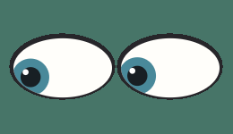
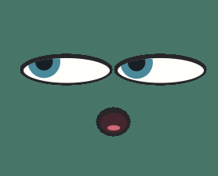
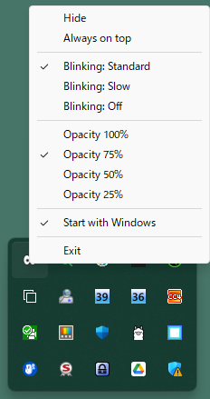

# Gaze

[English](README.md)

egui / eframe で作った、表情のある xeyes 風デスクトップアプリです。

<p align="center">
  
  
  
</p>

## 特徴

- 2つの目がデスクトップ上のマウスカーソルを追跡。小さな動きはゆっくり追い、大きく飛ぶと素早く追いつく、実際の目に近い動き
- カーソルが遠くなるにつれて目を細め、モニター対角線の半分の距離で最大まで細まる。瞳は瞼の下へ移動し、目の輪郭に沿って隠れる
- 瞳の大きさはウィンドウの縦幅と横幅の両方から決まる
- 3〜13秒の自然な分布で瞬きし、頻度は毎分約9回
- 16回に1回の割合で二度まばたきし、およそ2分に1回現れる
- 数分に1回、1秒近くかけてゆっくり閉じる瞬きを混ぜる（90秒以内に連続しない）
- 瞬きは標準・ゆっくり（約半分の頻度、読書中の人に近い）・なし から選択可能
- マウスとキーボードの入力が3分止まると、10秒ごとに `x = 無操作秒数 / 10`、`y = (x² - 324) / 576` の確率であくびし、5分止まると目を閉じて眠る
- 背景透過・タイトルバーなし・タスクバー非表示
- Windowsのシステムトレイから表示切替と終了が可能
- ログイン時の自動起動を設定可能（Windows・macOS ともに対応）
- 目の外周をドラッグしてウィンドウサイズを変更可能（Windows・macOS ともに対応）
- 常に手前に表示する設定
- macOSではデスクトップを切り替えても追従（フルスクリーンアプリの上にも表示）
- 透過度を 100%〜25% から選択可能
- 終了時の表示位置とサイズを記憶し、次回起動時に復元（Windowsのみ）
- 常に手前に表示・すべてのデスクトップに表示・瞬き・透過度の設定を次回起動時まで記憶
- DPI スケーリングに対応
- Windowsネイティブの再描画通知で、目の描画停止から自動復帰

目の中央付近をドラッグすると表示位置を移動できます。目の左右端では横方向、上下端では縦方向へサイズを変更できます。ウィンドウは 120×80 〜 540×320 pt の範囲で変更でき、顔はそのサイズに合わせて描かれます。

Windowsではトレイアイコンを左クリックまたは右クリックすると、表示切替、常に手前に表示、瞬き、透過度、自動起動、終了のメニューを開けます。それ以外のOSではトレイアイコンがないため、目の上で右クリックすると常に手前に表示、すべてのデスクトップに表示、ログイン時の自動起動、瞬き、透過度、終了のメニューを開けます。

すべてのデスクトップに表示は既定で有効で、macOS専用の設定です。Windowsには仮想デスクトップをまたいでウィンドウを固定する公式APIがないため、トレイメニューには項目がありません。

自動起動はログイン中のユーザーだけに設定され、管理者権限は不要です。Windowsはユーザーごとの `Run` レジストリキー、macOSは `~/Library/LaunchAgents/org.spumoni.gaze.plist` を使い、実行中の実行ファイルのパスを記録します。ビルドし直したり実行ファイルを移動した場合は、設定を一度オフにしてからオンにし直してください。チェックを入れた時点ではエージェントを読み込まない（＝Gazeが二重に起動しない）ため、反映は次回ログインからです。

常に手前に表示・すべてのデスクトップに表示・瞬き・透過度の設定は、Windowsでは `%APPDATA%\Gaze\settings.conf`、macOSでは `~/Library/Application Support/Gaze/settings.conf`、それ以外では `$XDG_CONFIG_HOME/Gaze/settings.conf` に保存されます。

Windowsの停止判定では、実際のマウスカーソル移動とRaw Inputのキー押下だけを入力として扱います。タッチ、ペン、その他のHIDや入力時刻だけの更新では待機時間をリセットしません。

変更履歴は [CHANGELOG.md](CHANGELOG.md)（英語）にあります。

## 実行

```sh
cargo run --release
```

Windows と macOS では、デスクトップ全体でカーソルを追跡します。それ以外の OS では、現在はウィンドウ内のカーソル位置しか追跡しないため、目を細める動作はほとんど起こりません。

## macOS向けのリリース

`scripts/macos-release.sh` が、ユニバーサルバイナリのビルド、`Gaze.app` の作成、Hardened Runtime 付きの署名、Developer ID Installer 証明書で署名した pkg の作成、Appleへの公証申請、チケットのステープルまでを一括で行います。

```bash
rustup target add x86_64-apple-darwin   # ユニバーサルバイナリ用に一度だけ

xcrun notarytool store-credentials notarytool \
  --apple-id <apple-id> --team-id <team-id> --password <app用パスワード>

scripts/macos-release.sh
```

証明書はキーチェーンから自動的に見つかります。Developer ID を複数持っている場合のみ `GAZE_APP_CERT` と `GAZE_INSTALLER_CERT` で指定してください。

インストーラーは `dist/` に出力されます。その他の設定は `scripts/macos-release.sh --help` を参照してください。証明書なしでパッケージングだけ確認するには `--unsigned`、ユニバーサルビルドを省くには `--host-arch` を指定します。

`Gaze.app` は `LSUIElement` を設定しているため、Windowsのタスクバーに出ないのと同様にDockとアプリスイッチャーに現れません。終了は目の上の右クリックメニューから行います。

アイコンは `assets/icon.png` から作られます。生成するには `cargo run --release --example icon` を実行してください。顔のデザインを変えたら再実行すれば、次のリリースから新しいアイコンが使われます。

`/Applications` へインストールすると実行ファイルの場所が変わるので、インストール後に自動起動の設定を一度オフにしてからオンにし直してください。

## 開発時の確認

```sh
cargo test
cargo fmt -- --check
cargo clippy --all-targets -- -D warnings
```
